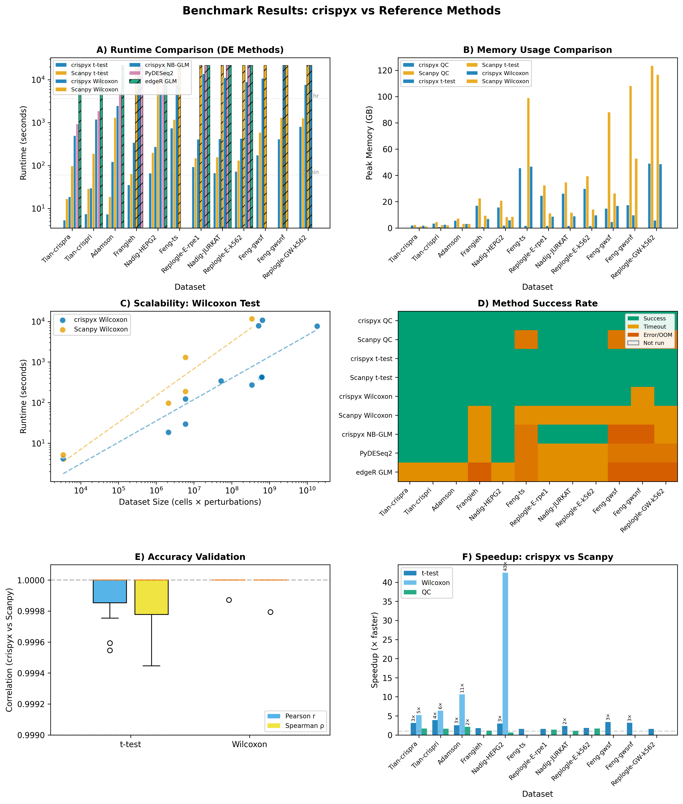

# crispyx

[](https://opensource.org/licenses/MIT)
[](https://www.python.org/downloads/)
[](https://pypi.org/project/crispyx)
[](https://pepy.tech/projects/crispyx)
[](https://github.com/jaydu1/crispyx/actions/workflows/tests.yml)

## Motivation

Genome-wide CRISPR screens routinely produce datasets with hundreds of thousands of cells and tens of thousands of genes. Standard single-cell analysis toolkits (Scanpy, Pertpy) load the entire count matrix into memory, which can require 30–100+ GB of RAM and makes many screens impractical to analyse on commodity hardware or shared HPC nodes with per-job memory limits.

**crispyx** solves this by streaming data directly from on-disk AnnData (`.h5ad`) files. Quality control, normalisation, pseudo-bulk aggregation, and differential expression all operate without materialising the full matrix in memory, so even the largest screens can be processed with modest resources.

## Features

- **Streaming QC & preprocessing** – Filter cells, perturbations, and genes; normalise and log-transform; all without loading the full matrix into memory
- **Pseudo-bulk aggregation** – Average log expression and pseudo-bulk count matrices for effect size estimation
- **Differential expression** – t-test, Wilcoxon rank-sum, and negative binomial GLM with apeGLM LFC shrinkage; multi-core support and adaptive memory management
- **Dimension reduction** – Memory-efficient PCA and KNN graph construction on backed data
- **Scanpy-compatible API & plotting** – Familiar `cx.pp`, `cx.pb`, `cx.tl`, and `cx.pl` namespaces; Scanpy-style rank genes plots, volcano, MA, PCA, UMAP, QC summaries, and overlap heatmaps
- **Data preparation utilities** – Edit backed metadata without loading X; standardise gene names; normalise perturbation labels; auto-detect metadata columns
- **HPC-ready** – Resume/checkpoint for long-running jobs; configurable `memory_limit_gb`; Docker and Singularity support

## Quick Start

```python
import crispyx as cx

# Open dataset without loading into memory
adata = cx.read_h5ad_ondisk("data/demo_benchmark.h5ad")

# Quality control with adaptive thresholds
adata = cx.pp.qc_summary(
    adata,
    perturbation_column="perturbation",
    min_genes=5,
    min_cells_per_perturbation=5,
)

# Differential expression
adata = cx.tl.rank_genes_groups(
    adata,
    perturbation_column="perturbation",
    method="wilcoxon",  # or "t-test", "nb_glm"
)

# Access results
print(adata.uns["rank_genes_groups"])
de_results = adata.uns["rank_genes_groups"].load()
```

For the full workflow (normalisation, PCA, pseudo-bulk, NB-GLM, LFC shrinkage, plotting, data preparation utilities), see the [Usage Guide](docs/usage.rst) and the [tutorial notebook](docs/crispyx_tutorial.ipynb).

## Performance

Benchmarked across 12 CRISPR screen datasets (21k–1.97M cells), crispyx consistently outperforms Scanpy, Pertpy/PyDESeq2, and edgeR in both speed and memory:

| Metric | crispyx vs Scanpy | crispyx vs Pertpy/PyDESeq2 |
|---|---|---|
| **t-test** | **2–11× faster** | — |
| **Wilcoxon** | **2–43× faster** | — |
| **NB-GLM** | — | **2× faster**, completes where Pertpy OOMs |
| **Peak memory** | **2–6× lower** | Runs within 64 GB where Pertpy exceeds 120 GB |
| **Accuracy** | Pearson *r* > 0.999 vs Scanpy | Pearson *r* > 0.97 vs PyDESeq2 |

crispyx succeeds on **all 12 datasets**, while Scanpy times out or OOMs on the largest screens and Pertpy/edgeR fail on most genome-wide datasets.

<p align="center">
  
</p>

See [benchmarking/](benchmarking/) for full results and reproduction scripts.

## Installation

```bash
pip install -e .
```

## Benchmarking

```bash
cd benchmarking
./run_benchmark.sh config/Adamson.yaml       # single dataset
./run_benchmark.sh config/*.yaml             # all datasets
```

See [benchmarking/README.md](benchmarking/README.md) for configuration options and output structure.

## Testing

```bash
pytest
```

## Documentation

```bash
sphinx-build docs docs/_build
```

## Contributing

Suggestions, bug reports, and contributions are welcome! Please open an [issue](https://github.com/jaydu1/crispyx/issues) or submit a pull request.
