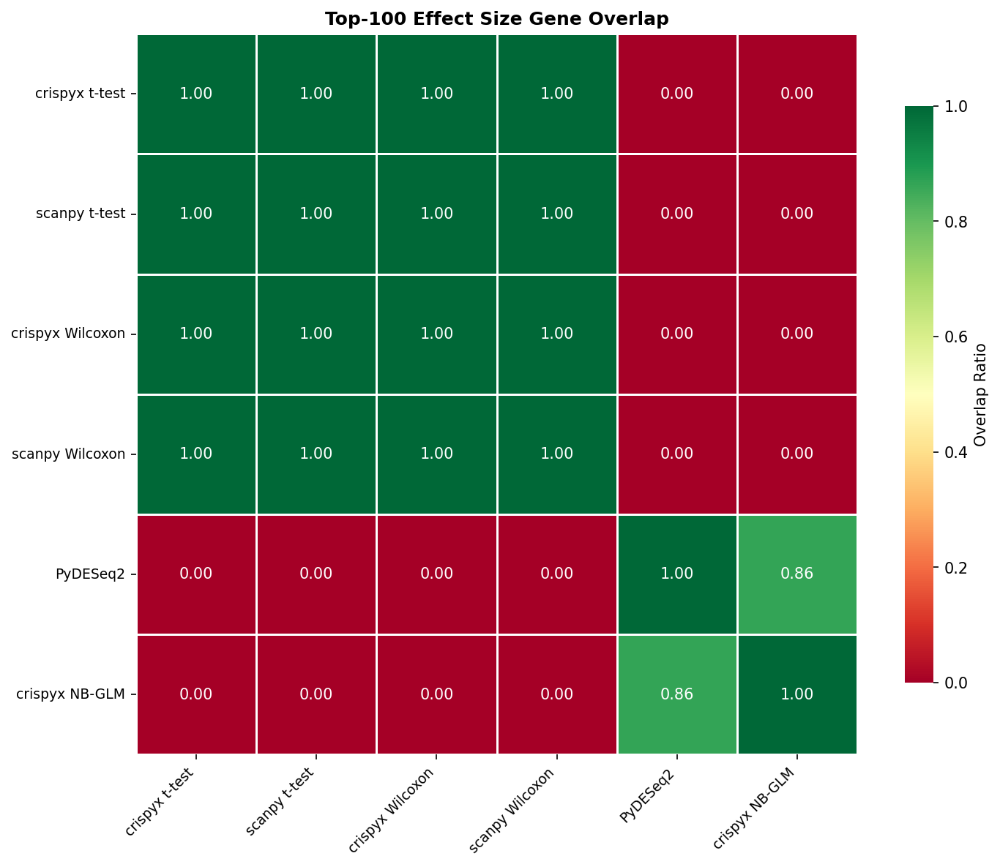
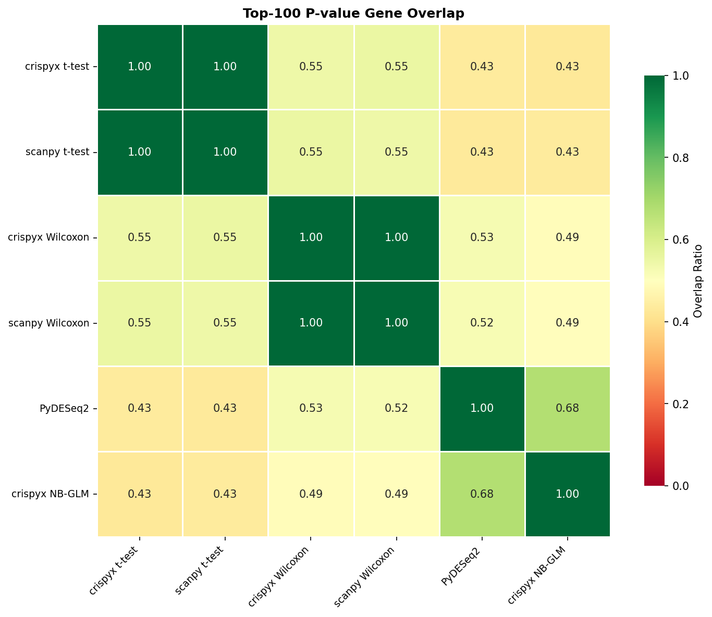

# Benchmark Results

## 1. Performance

### Preprocessing / QC

| Package | Method | Status | Total (s) | Memory (MB) | Cells | Genes |
| --- | --- | --- | --- | --- | --- | --- |
| crispyx | QC filter | success | 22.24 | 2708.72 | 65282.0 | 19568.0 |
| scanpy | QC filter | success | 16.0 | 7356.8 | 65282.0 | 19568.0 |
| crispyx | pseudobulk (avg log) | success | 22.8 | 1966.62 |  |  |
| crispyx | pseudobulk | success | 16.6 | 1455.79 |  |  |

### DE: t-test

| Package | Method | Status | Total (s) | Memory (MB) | Groups |
| --- | --- | --- | --- | --- | --- |
| scanpy | t-test | success | 22.74 | 3049.93 | 91 |
| crispyx | t-test | success | 6.66 | 349.39 | 91 |

### DE: Wilcoxon

| Package | Method | Status | Total (s) | Memory (MB) | Groups |
| --- | --- | --- | --- | --- | --- |
| crispyx | Wilcoxon | success | 83.48 | 3841.77 | 91 |
| scanpy | Wilcoxon | success | 775.89 | 3736.02 | 91 |

### DE: NB GLM

| Package | Method | Status | Total (s) | Memory (MB) | Groups |
| --- | --- | --- | --- | --- | --- |
| crispyx | NB-GLM | success | 1699.8 | 3433.71 | 91.0 |
| edgeR | NB-GLM | timeout | 7260.11 |  |  |
| pertpy | NB-GLM | success | 5944.33 | 45839.97 | 91.0 |

## 2. Performance Comparison

### crispyx vs Reference Tools

_crispyx as baseline. Negative values = crispyx is faster/uses less memory._

#### Preprocessing / QC

| crispyx method | compared to | Time Δ | Time % |  | Mem Δ | Mem % |   |
| --- | --- | --- | --- | --- | --- | --- | --- |
| QC filter | scanpy QC filter | +6.2s | 139.0% | ❌ | -4648.1 MB | 36.8% | ✅ |

#### DE: t-test

| crispyx method | compared to | Time Δ | Time % |  | Mem Δ | Mem % |   |
| --- | --- | --- | --- | --- | --- | --- | --- |
| t-test | scanpy t-test | -16.1s | 29.3% | ✅ | -2700.5 MB | 11.5% | ✅ |

#### DE: Wilcoxon

| crispyx method | compared to | Time Δ | Time % |  | Mem Δ | Mem % |   |
| --- | --- | --- | --- | --- | --- | --- | --- |
| Wilcoxon | scanpy Wilcoxon | -692.4s | 10.8% | ✅ | +105.8 MB | 102.8% | ⚠️ |

#### DE: NB GLM

| crispyx method | compared to | Time Δ | Time % |  | Mem Δ | Mem % |   |
| --- | --- | --- | --- | --- | --- | --- | --- |
| NB-GLM | pertpy NB-GLM | -4244.5s | 28.6% | ✅ | -42406.3 MB | 7.5% | ✅ |

## 3. Accuracy

_Correlation metrics between crispyx and reference methods. ✅ >0.95, ⚠️ 0.8-0.95, ❌ <0.8_

### Preprocessing / QC

| crispyx method | compared to | Cells Δ |  | Genes Δ |   |
| --- | --- | --- | --- | --- | --- |
| QC filter | scanpy QC filter | +0 | ✅ | +0 | ✅ |

### DE: t-test

| crispyx method | compared to | Eff ρ |  | Eff ρₛ |   | Stat ρ |    | Stat ρₛ |     | log-Pval ρ |      | log-Pval ρₛ |       |
| --- | --- | --- | --- | --- | --- | --- | --- | --- | --- | --- | --- | --- | --- |
| t-test | scanpy t-test | 1.000 <small>±0.000</small> | ✅ | 1.000 <small>±0.000</small> | ✅ | 1.000 <small>±0.000</small> | ✅ | 1.000 <small>±0.000</small> | ✅ | 1.000 <small>±0.000</small> | ✅ | 1.000 <small>±0.000</small> | ✅ |

### DE: Wilcoxon

| crispyx method | compared to | Eff ρ |  | Eff ρₛ |   | Stat ρ |    | Stat ρₛ |     | log-Pval ρ |      | log-Pval ρₛ |       |
| --- | --- | --- | --- | --- | --- | --- | --- | --- | --- | --- | --- | --- | --- |
| Wilcoxon | scanpy Wilcoxon | 1.000 <small>±0.000</small> | ✅ | 1.000 <small>±0.000</small> | ✅ | 1.000 <small>±0.000</small> | ✅ | 1.000 <small>±0.000</small> | ✅ | 1.000 <small>±0.000</small> | ✅ | 1.000 <small>±0.000</small> | ✅ |

### DE: NB GLM

| crispyx method | compared to | Eff ρ |  | Eff ρₛ |   | Stat ρ |    | Stat ρₛ |     | log-Pval ρ |      | log-Pval ρₛ |       |
| --- | --- | --- | --- | --- | --- | --- | --- | --- | --- | --- | --- | --- | --- |
| NB-GLM | pertpy NB-GLM | 0.994 <small>±0.009</small> | ✅ | 0.997 <small>±0.002</small> | ✅ | 0.913 <small>±0.080</small> | ⚠️ | 0.617 <small>±0.208</small> | ❌ | 0.884 <small>±0.084</small> | ⚠️ | 0.438 <small>±0.237</small> | ❌ |

## 4. Gene Set Overlap

_Overlap ratio of top-k DE genes between methods. ✅ >0.7, ⚠️ 0.5-0.7, ❌ <0.5_

### Effect Size Overlap

| crispyx method | compared to | Top-50 |  | Top-100 |   | Top-500 |    |
| --- | --- | --- | --- | --- | --- | --- | --- |
| t-test | scanpy t-test | 1.000 | ✅ | 1.000 | ✅ | 1.000 | ✅ |
| Wilcoxon | scanpy Wilcoxon | 1.000 | ✅ | 1.000 | ✅ | 1.000 | ✅ |
| NB-GLM | pertpy NB-GLM | 0.867 | ✅ | 0.863 | ✅ | 0.871 | ✅ |

### P-value Overlap

| crispyx method | compared to | Top-50 |  | Top-100 |   | Top-500 |    |
| --- | --- | --- | --- | --- | --- | --- | --- |
| t-test | scanpy t-test | 1.000 | ✅ | 1.000 | ✅ | 1.000 | ✅ |
| Wilcoxon | scanpy Wilcoxon | 1.000 | ✅ | 1.000 | ✅ | 1.000 | ✅ |
| NB-GLM | pertpy NB-GLM | 0.647 | ⚠️ | 0.675 | ⚠️ | 0.760 | ✅ |

_Note: Some methods are missing due to errors:_
- NB-GLM vs edgeR NB-GLM: _method error: edger_de_glm (timeout)_

### Overlap Heatmaps (Top-100)

#### Effect Size

#### P-value

---

**Legend:**
- **Performance:** ✅ >10% better | ⚠️ within ±10% | ❌ >10% worse
- **Accuracy:** ✅ ρ≥0.95 | ⚠️ 0.8≤ρ<0.95 | ❌ ρ<0.8
- **Overlap:** ✅ ≥0.7 | ⚠️ 0.5-0.7 | ❌ <0.5
- **Shrinkage:** ✅ <1% inflated | ⚠️ 1-10% inflated | ❌ >10% inflated

**Abbreviations:**
- ρ = Pearson correlation, ρₛ = Spearman correlation
- log-Pval = correlations on -log₁₀(p) transformed values
- sf=per = per-comparison size factor estimation (matches PyDESeq2)

**Notes:**
- Correlation and overlap values shown as mean±std across perturbations
- crispyx lfcShrink uses `method='stats'` (Gaussian approximation) which is numerically stable and ~35× faster than `method='full'`.
- P-value overlap excludes lfcShrink methods since shrinkage only affects effect sizes, not p-values.
- **Warning:** PyDESeq2 may produce aberrant shrinkage when dispersion trend fitting fails. crispyx shrinkage is more robust.
