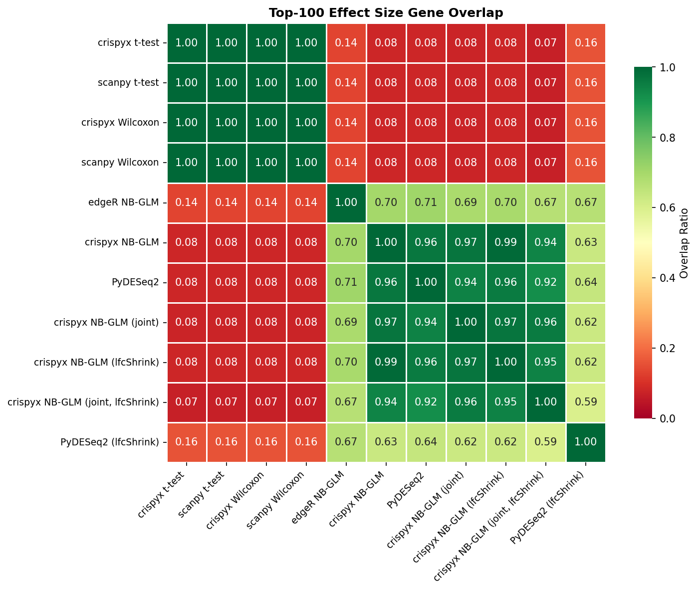
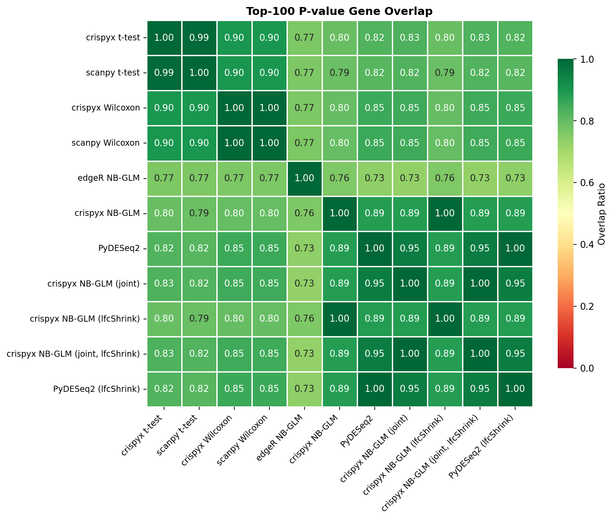

# Benchmark Results

## 1. Performance

### Preprocessing / QC

| Package | Method | Status | Time (s) | Memory (MB) | Cells | Genes |
| --- | --- | --- | --- | --- | --- | --- |
| crispyx | QC filter | success | 3.6 | 518.88 | 1716.0 | 10500.0 |
| scanpy | QC filter | success | 3.81 | 520.19 | 1716.0 | 10500.0 |
| crispyx | pseudobulk (avg log) | success | 2.98 | 748.87 |  |  |
| crispyx | pseudobulk | success | 2.86 | 596.65 |  |  |

### DE: t-test

| Package | Method | Status | Time (s) | Memory (MB) | Groups |
| --- | --- | --- | --- | --- | --- |
| scanpy | t-test | success | 5.31 | 445.99 | 2 |
| crispyx | t-test | success | 2.53 | 398.9 | 2 |

### DE: Wilcoxon

| Package | Method | Status | Time (s) | Memory (MB) | Groups |
| --- | --- | --- | --- | --- | --- |
| crispyx | Wilcoxon | success | 7.78 | 395.63 | 2 |
| scanpy | Wilcoxon | success | 22.57 | 705.87 | 2 |

### DE: NB GLM

| Package | Method | lfcShrink | Status | Time (s) | Memory (MB) | Groups |
| --- | --- | --- | --- | --- | --- | --- |
| crispyx | NB-GLM | ✓ | success | 91.99 | 3550.29 | 2 |
| crispyx | NB-GLM (joint) | ✓ | success | 107.87 | 5167.59 | 2 |
| edgeR | NB-GLM |  | success | 95.13 | 2255.57 | 2 |
| pertpy | NB-GLM | ✓ | success | 33.52 | 2807.01 | 2 |

## 2. Performance Comparison

### crispyx vs Reference Tools

_crispyx as baseline. Negative values = crispyx is faster/uses less memory._

#### Preprocessing / QC

| crispyx method | compared to | Time Δ | Time % |  | Mem Δ | Mem % |   |
| --- | --- | --- | --- | --- | --- | --- | --- |
| QC filter | scanpy QC filter | -0.2s | 94.4% | ⚠️ | -1.3 MB | 99.7% | ⚠️ |

#### DE: t-test

| crispyx method | compared to | Time Δ | Time % |  | Mem Δ | Mem % |   |
| --- | --- | --- | --- | --- | --- | --- | --- |
| t-test | scanpy t-test | -2.8s | 47.6% | ✅ | -47.1 MB | 89.4% | ✅ |

#### DE: Wilcoxon

| crispyx method | compared to | Time Δ | Time % |  | Mem Δ | Mem % |   |
| --- | --- | --- | --- | --- | --- | --- | --- |
| Wilcoxon | scanpy Wilcoxon | -14.8s | 34.5% | ✅ | -310.2 MB | 56.0% | ✅ |

#### DE: NB GLM

| crispyx method | lfcShrink | compared to | lfcShrink (ref) | Time Δ | Time % |  | Mem Δ | Mem % |   |
| --- | --- | --- | --- | --- | --- | --- | --- | --- | --- |
| NB-GLM | ✓ | edgeR NB-GLM |  | -3.1s | 96.7% | ⚠️ | +1294.7 MB | 157.4% | ❌ |
| NB-GLM | ✓ | pertpy NB-GLM | ✓ | +58.5s | 274.4% | ❌ | +743.3 MB | 126.5% | ❌ |
| NB-GLM | ✓ | pertpy NB-GLM | ✓ | +58.5s | 274.4% | ❌ | +743.3 MB | 126.5% | ❌ |
| NB-GLM (joint) | ✓ | edgeR NB-GLM |  | +12.7s | 113.4% | ❌ | +2912.0 MB | 229.1% | ❌ |
| NB-GLM (joint) | ✓ | pertpy NB-GLM | ✓ | +74.3s | 321.8% | ❌ | +2360.6 MB | 184.1% | ❌ |
| NB-GLM (joint) | ✓ | pertpy NB-GLM | ✓ | +74.3s | 321.8% | ❌ | +2360.6 MB | 184.1% | ❌ |

### Tool Comparisons

_Comparisons between external tools._

| package A | method A | package B | method B | Time Δ (A-B) | Time % (A/B) |  | Mem Δ (A-B) | Mem % (A/B) |   |
| --- | --- | --- | --- | --- | --- | --- | --- | --- | --- |
| edgeR | NB-GLM | pertpy | NB-GLM | +61.6s | 283.8% | ❌ | -551.4 MB | 80.4% | ✅ |

## 3. Accuracy

_Correlation metrics between crispyx and reference methods. ✅ >0.95, ⚠️ 0.8-0.95, ❌ <0.8_

### Preprocessing / QC

| crispyx method | compared to | Cells Δ |  | Genes Δ |   |
| --- | --- | --- | --- | --- | --- |
| QC filter | scanpy QC filter | +0 | ✅ | +0 | ✅ |

### DE: t-test

| crispyx method | compared to | Eff ρ |  | Eff ρₛ |   | Stat ρ |    | Stat ρₛ |     | log-Pval ρ |      | log-Pval ρₛ |       |
| --- | --- | --- | --- | --- | --- | --- | --- | --- | --- | --- | --- | --- | --- |
| t-test | scanpy t-test | 1.000 <small>±0.000</small> | ✅ | 1.000 <small>±0.000</small> | ✅ | 1.000 <small>±0.000</small> | ✅ | 1.000 <small>±0.000</small> | ✅ | 0.998 <small>±0.003</small> | ✅ | 1.000 <small>±0.000</small> | ✅ |

### DE: Wilcoxon

| crispyx method | compared to | Eff ρ |  | Eff ρₛ |   | Stat ρ |    | Stat ρₛ |     | log-Pval ρ |      | log-Pval ρₛ |       |
| --- | --- | --- | --- | --- | --- | --- | --- | --- | --- | --- | --- | --- | --- |
| Wilcoxon | scanpy Wilcoxon | 1.000 <small>±0.000</small> | ✅ | 1.000 <small>±0.000</small> | ✅ | 1.000 <small>±0.000</small> | ✅ | 1.000 <small>±0.000</small> | ✅ | 1.000 | ✅ | 1.000 <small>±0.000</small> | ✅ |

### DE: NB GLM

| crispyx method | lfcShrink | compared to | lfcShrink (ref) | Eff ρ |  | Eff ρₛ |   | Stat ρ |    | Stat ρₛ |     | log-Pval ρ |      | log-Pval ρₛ |       |
| --- | --- | --- | --- | --- | --- | --- | --- | --- | --- | --- | --- | --- | --- | --- | --- |
| NB-GLM | ✓ | edgeR NB-GLM |  | 0.918 <small>±0.029</small> | ⚠️ | 0.924 <small>±0.060</small> | ⚠️ | 0.665 <small>±0.149</small> | ❌ | 0.500 <small>±0.040</small> | ❌ | 0.906 <small>±0.032</small> | ⚠️ | 0.525 <small>±0.142</small> | ❌ |
| NB-GLM | ✓ | pertpy NB-GLM | ✓ | 0.999 <small>±0.001</small> | ✅ | 0.999 <small>±0.000</small> | ✅ | 0.962 <small>±0.005</small> | ✅ | 0.860 <small>±0.065</small> | ⚠️ | 0.962 <small>±0.009</small> | ✅ | 0.749 <small>±0.115</small> | ❌ |
| NB-GLM | ✓ | pertpy NB-GLM | ✓ | 0.897 <small>±0.075</small> | ⚠️ | 0.893 <small>±0.036</small> | ⚠️ | 0.962 <small>±0.005</small> | ✅ | 0.860 <small>±0.065</small> | ⚠️ | 0.962 <small>±0.009</small> | ✅ | 0.749 <small>±0.115</small> | ❌ |
| NB-GLM (joint) | ✓ | edgeR NB-GLM |  | 0.916 <small>±0.026</small> | ⚠️ | 0.920 <small>±0.053</small> | ⚠️ | 0.599 <small>±0.168</small> | ❌ | 0.320 <small>±0.004</small> | ❌ | 0.881 <small>±0.032</small> | ⚠️ | 0.497 <small>±0.050</small> | ❌ |
| NB-GLM (joint) | ✓ | pertpy NB-GLM | ✓ | 0.995 <small>±0.002</small> | ✅ | 0.991 <small>±0.001</small> | ✅ | 0.996 <small>±0.001</small> | ✅ | 0.987 <small>±0.007</small> | ✅ | 0.992 <small>±0.005</small> | ✅ | 0.979 <small>±0.006</small> | ✅ |
| NB-GLM (joint) | ✓ | pertpy NB-GLM | ✓ | 0.911 <small>±0.084</small> | ⚠️ | 0.942 <small>±0.040</small> | ⚠️ | 0.996 <small>±0.001</small> | ✅ | 0.987 <small>±0.007</small> | ✅ | 0.992 <small>±0.005</small> | ✅ | 0.979 <small>±0.006</small> | ✅ |

### Tool Comparisons

| package A | method A | package B | method B | Eff ρ |  | Eff ρₛ |   | Stat ρ |    | Stat ρₛ |     | log-Pval ρ |      | log-Pval ρₛ |       |
| --- | --- | --- | --- | --- | --- | --- | --- | --- | --- | --- | --- | --- | --- | --- | --- |
| edgeR | NB-GLM | pertpy | NB-GLM | 0.918 <small>±0.028</small> | ⚠️ | 0.924 <small>±0.060</small> | ⚠️ | 0.595 <small>±0.163</small> | ❌ | 0.277 <small>±0.008</small> | ❌ | 0.887 <small>±0.019</small> | ⚠️ | 0.488 <small>±0.045</small> | ❌ |

## 4. Gene Set Overlap

_Overlap ratio of top-k DE genes between methods. ✅ >0.7, ⚠️ 0.5-0.7, ❌ <0.5_

### Effect Size Overlap

| crispyx method | lfcShrink | compared to | lfcShrink (ref) | Top-50 |  | Top-100 |   | Top-500 |    |
| --- | --- | --- | --- | --- | --- | --- | --- | --- | --- |
| t-test |  | scanpy t-test |  | 1.000 | ✅ | 1.000 | ✅ | 1.000 | ✅ |
| Wilcoxon |  | scanpy Wilcoxon |  | 1.000 | ✅ | 1.000 | ✅ | 1.000 | ✅ |
| NB-GLM |  | pertpy NB-GLM | ✓ | 0.720 | ✅ | 0.710 <small>±0.085</small> | ✅ | 0.716 <small>±0.054</small> | ✅ |
| NB-GLM | ✓ | edgeR NB-GLM |  | 0.720 | ✅ | 0.700 <small>±0.071</small> | ✅ | 0.716 <small>±0.057</small> | ✅ |
| NB-GLM | ✓ | pertpy NB-GLM | ✓ | 0.960 | ✅ | 0.965 <small>±0.007</small> | ✅ | 0.970 <small>±0.020</small> | ✅ |
| NB-GLM | ✓ | pertpy NB-GLM | ✓ | 0.440 | ❌ | 0.625 <small>±0.219</small> | ⚠️ | 0.776 <small>±0.192</small> | ✅ |
| NB-GLM (joint) | ✓ | edgeR NB-GLM |  | 0.680 | ⚠️ | 0.690 <small>±0.071</small> | ⚠️ | 0.707 <small>±0.055</small> | ✅ |
| NB-GLM (joint) | ✓ | pertpy NB-GLM | ✓ | 0.920 | ✅ | 0.945 <small>±0.007</small> | ✅ | 0.959 <small>±0.021</small> | ✅ |
| NB-GLM (joint) | ✓ | pertpy NB-GLM | ✓ | 0.400 | ❌ | 0.595 <small>±0.191</small> | ⚠️ | 0.739 <small>±0.180</small> | ✅ |

### P-value Overlap

| crispyx method | lfcShrink | compared to | lfcShrink (ref) | Top-50 |  | Top-100 |   | Top-500 |    |
| --- | --- | --- | --- | --- | --- | --- | --- | --- | --- |
| t-test |  | scanpy t-test |  | 0.980 | ✅ | 0.995 <small>±0.007</small> | ✅ | 1.000 | ✅ |
| Wilcoxon |  | scanpy Wilcoxon |  | 1.000 | ✅ | 1.000 | ✅ | 1.000 | ✅ |
| NB-GLM |  | pertpy NB-GLM | ✓ | 0.720 | ✅ | 0.735 <small>±0.049</small> | ✅ | 0.780 <small>±0.068</small> | ✅ |
| NB-GLM | ✓ | edgeR NB-GLM |  | 0.780 | ✅ | 0.760 <small>±0.099</small> | ✅ | 0.803 <small>±0.078</small> | ✅ |
| NB-GLM | ✓ | pertpy NB-GLM | ✓ | 0.820 | ✅ | 0.885 <small>±0.035</small> | ✅ | 0.918 <small>±0.003</small> | ✅ |
| NB-GLM | ✓ | pertpy NB-GLM | ✓ | 0.820 | ✅ | 0.885 <small>±0.035</small> | ✅ | 0.918 <small>±0.003</small> | ✅ |
| NB-GLM (joint) | ✓ | edgeR NB-GLM |  | 0.740 | ✅ | 0.730 <small>±0.085</small> | ✅ | 0.779 <small>±0.086</small> | ✅ |
| NB-GLM (joint) | ✓ | pertpy NB-GLM | ✓ | 0.920 | ✅ | 0.955 <small>±0.021</small> | ✅ | 0.967 <small>±0.001</small> | ✅ |
| NB-GLM (joint) | ✓ | pertpy NB-GLM | ✓ | 0.920 | ✅ | 0.955 <small>±0.021</small> | ✅ | 0.967 <small>±0.001</small> | ✅ |

### Overlap Heatmaps (Top-100)

#### Effect Size

#### P-value

---

**Legend:**
- Performance: ✅ >10% better | ⚠️ within ±10% | ❌ >10% worse
- Accuracy: ✅ ρ≥0.95 | ⚠️ 0.8≤ρ<0.95 | ❌ ρ<0.8
- Overlap: ✅ ≥0.7 | ⚠️ 0.5-0.7 | ❌ <0.5
- ρ = Pearson correlation, ρₛ = Spearman correlation
- Correlation and overlap values shown as mean±std across perturbations
- log-Pval: correlations computed on -log₁₀(p) transformed values
- Top-k overlap: fraction of top-k genes shared between methods
- lfcShrink column: shrinkage type used (apeglm, ashr, normal) or blank if none
