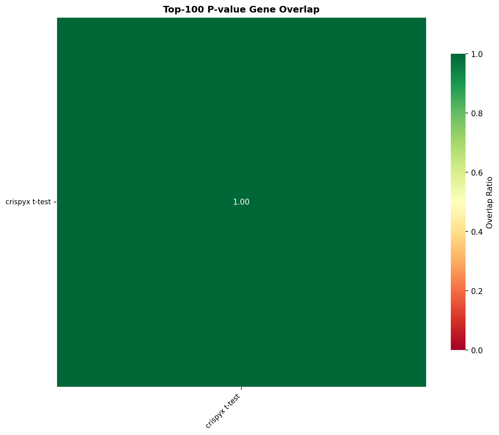

# Benchmark Results

## 1. Performance

### Preprocessing / QC

| Package | Method | Status | Total (s) | Memory (MB) |
| --- | --- | --- | --- | --- |
| scanpy | QC filter | memory_limit | 743.52 | 112466.9 |
| crispyx | QC filter | error | 3394.65 |  |
| crispyx | pseudobulk (avg log) | success | 4836.87 | 29081.86 |
| crispyx | pseudobulk | success | 4091.18 | 29049.24 |

### DE: t-test

| Package | Method | Status | Total (s) | Memory (MB) | Groups |
| --- | --- | --- | --- | --- | --- |
| scanpy | t-test | memory_limit | 1042.25 | 111890.28 |  |
| crispyx | t-test | success | 3432.24 | 47251.06 | 18311.0 |

### DE: Wilcoxon

| Package | Method | Status | Total (s) | Memory (MB) | Groups |
| --- | --- | --- | --- | --- | --- |
| crispyx | Wilcoxon | memory_limit | 1489.85 | 123132.03 |  |
| scanpy | Wilcoxon | memory_limit | 493.68 | 112429.21 |  |

## 2. Performance Comparison

## 3. Accuracy

_Correlation metrics between crispyx and reference methods. ✅ >0.95, ⚠️ 0.8-0.95, ❌ <0.8_

## 4. Gene Set Overlap

_Overlap ratio of top-k DE genes between methods. ✅ >0.7, ⚠️ 0.5-0.7, ❌ <0.5_

_No overlap data available._

### Overlap Heatmaps (Top-100)

#### Effect Size

#### P-value

---

**Legend:**
- **Performance:** ✅ >10% better | ⚠️ within ±10% | ❌ >10% worse
- **Accuracy:** ✅ ρ≥0.95 | ⚠️ 0.8≤ρ<0.95 | ❌ ρ<0.8
- **Overlap:** ✅ ≥0.7 | ⚠️ 0.5-0.7 | ❌ <0.5
- **Shrinkage:** ✅ <1% inflated | ⚠️ 1-10% inflated | ❌ >10% inflated

**Abbreviations:**
- ρ = Pearson correlation, ρₛ = Spearman correlation
- log-Pval = correlations on -log₁₀(p) transformed values
- sf=per = per-comparison size factor estimation (matches PyDESeq2)

**Notes:**
- Correlation and overlap values shown as mean±std across perturbations
- crispyx lfcShrink uses `method='stats'` (Gaussian approximation) which is numerically stable and ~35× faster than `method='full'`.
- P-value overlap excludes lfcShrink methods since shrinkage only affects effect sizes, not p-values.
- **Warning:** PyDESeq2 may produce aberrant shrinkage when dispersion trend fitting fails. crispyx shrinkage is more robust.
