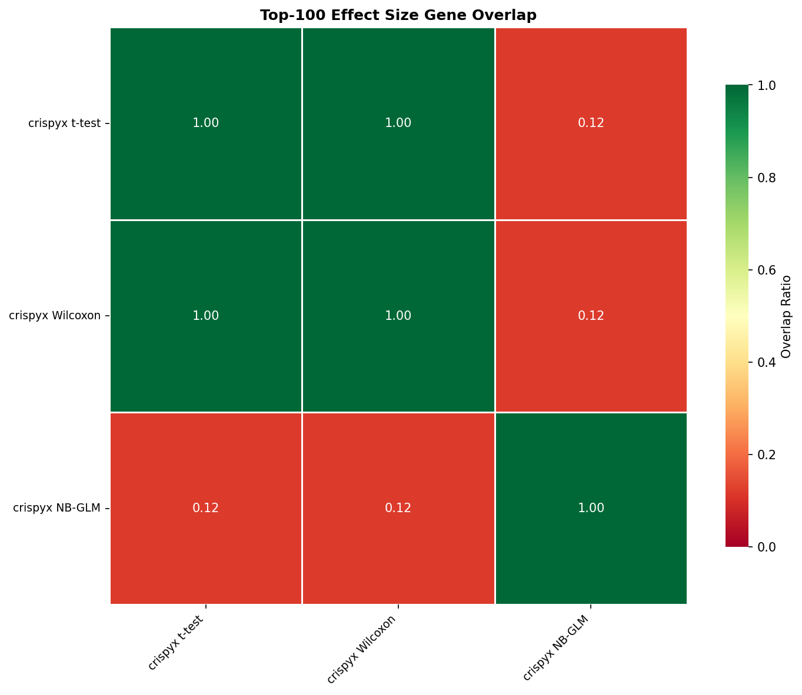
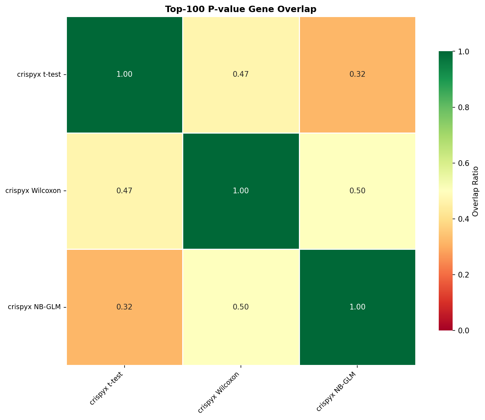

# Benchmark Results

## 1. Performance

### Preprocessing / QC

| Package | Method | Status | Total (s) | Memory (MB) | Cells | Genes |
| --- | --- | --- | --- | --- | --- | --- |
| crispyx | QC filter | success | 31.6 | 26901.38 | 259086.0 | 8882.0 |
| scanpy | QC filter | success | 55.8 | 35684.35 | 259086.0 | 8882.0 |
| crispyx | pseudobulk (avg log) | success | 36.22 | 1483.48 |  |  |
| crispyx | pseudobulk | success | 27.79 | 1224.77 |  |  |

### DE: t-test

| Package | Method | Status | Total (s) | Memory (MB) | Groups |
| --- | --- | --- | --- | --- | --- |
| scanpy | t-test | error | 49.7 | 8078.62 |  |
| crispyx | t-test | success | 84.2 | 1824.98 | 2393.0 |

### DE: Wilcoxon

| Package | Method | Status | Total (s) | Memory (MB) | Groups |
| --- | --- | --- | --- | --- | --- |
| crispyx | Wilcoxon | success | 771.81 | 14568.07 | 2393.0 |
| scanpy | Wilcoxon | error | 146.3 | 9911.8 |  |

### DE: NB GLM

| Package | Method | Status | Total (s) | Memory (MB) | Groups |
| --- | --- | --- | --- | --- | --- |
| crispyx | NB-GLM | success | 11258.18 | 6629.15 | 2393.0 |
| edgeR | NB-GLM | timeout | 21605.11 |  |  |
| pertpy | NB-GLM | error | 15593.19 | 18283.24 |  |

## 2. Performance Comparison

### crispyx vs Reference Tools

_crispyx as baseline. Negative values = crispyx is faster/uses less memory._

#### Preprocessing / QC

| crispyx method | compared to | Time Δ | Time % |  | Mem Δ | Mem % |   |
| --- | --- | --- | --- | --- | --- | --- | --- |
| QC filter | scanpy QC filter | -24.2s | 56.6% | ✅ | -8783.0 MB | 75.4% | ✅ |

## 3. Accuracy

_Correlation metrics between crispyx and reference methods. ✅ >0.95, ⚠️ 0.8-0.95, ❌ <0.8_

### Preprocessing / QC

| crispyx method | compared to | Cells Δ |  | Genes Δ |   |
| --- | --- | --- | --- | --- | --- |
| QC filter | scanpy QC filter | +0 | ✅ | +0 | ✅ |

## 4. Gene Set Overlap

_Overlap ratio of top-k DE genes between methods. ✅ >0.7, ⚠️ 0.5-0.7, ❌ <0.5_

### Effect Size Overlap

_No overlap data available._

### P-value Overlap

_No overlap data available._

_Note: Some methods are missing due to errors:_
- NB-GLM vs edgeR NB-GLM: _method error: edger_de_glm (timeout)_
- NB-GLM vs pertpy NB-GLM: _method error: pertpy_de_pydeseq2 (error)_
- t-test vs scanpy t-test: _method error: scanpy_de_t_test (error)_
- Wilcoxon vs scanpy Wilcoxon: _method error: scanpy_de_wilcoxon (error)_

### Overlap Heatmaps (Top-100)

#### Effect Size

#### P-value

---

**Legend:**
- **Performance:** ✅ >10% better | ⚠️ within ±10% | ❌ >10% worse
- **Accuracy:** ✅ ρ≥0.95 | ⚠️ 0.8≤ρ<0.95 | ❌ ρ<0.8
- **Overlap:** ✅ ≥0.7 | ⚠️ 0.5-0.7 | ❌ <0.5
- **Shrinkage:** ✅ <1% inflated | ⚠️ 1-10% inflated | ❌ >10% inflated

**Abbreviations:**
- ρ = Pearson correlation, ρₛ = Spearman correlation
- log-Pval = correlations on -log₁₀(p) transformed values
- sf=per = per-comparison size factor estimation (matches PyDESeq2)

**Notes:**
- Correlation and overlap values shown as mean±std across perturbations
- crispyx lfcShrink uses `method='stats'` (Gaussian approximation) which is numerically stable and ~35× faster than `method='full'`.
- P-value overlap excludes lfcShrink methods since shrinkage only affects effect sizes, not p-values.
- **Warning:** PyDESeq2 may produce aberrant shrinkage when dispersion trend fitting fails. crispyx shrinkage is more robust.
