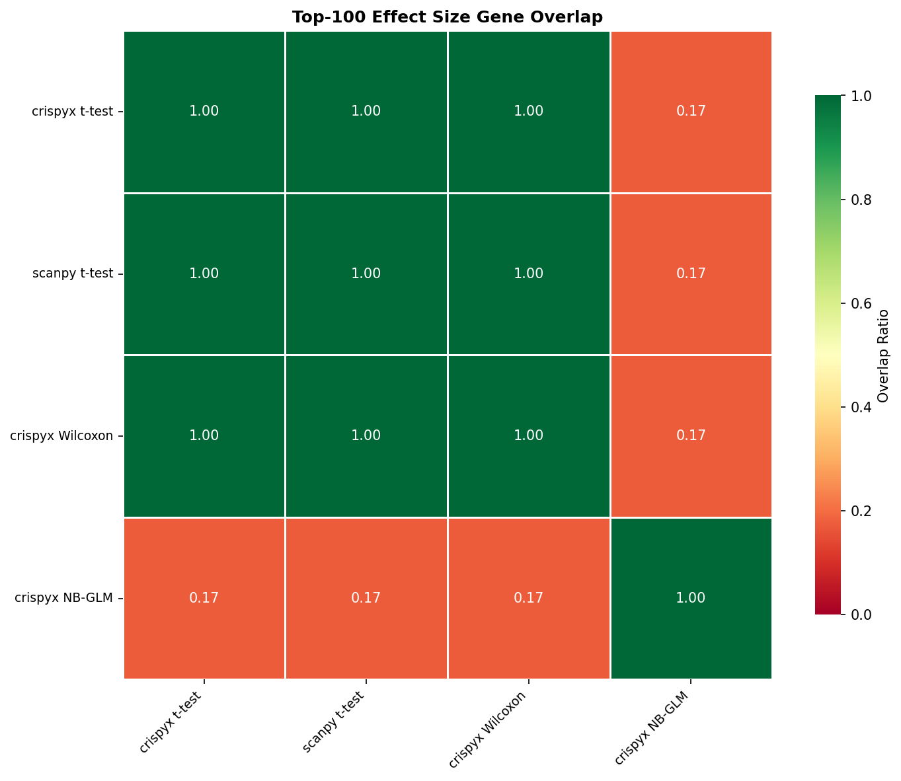
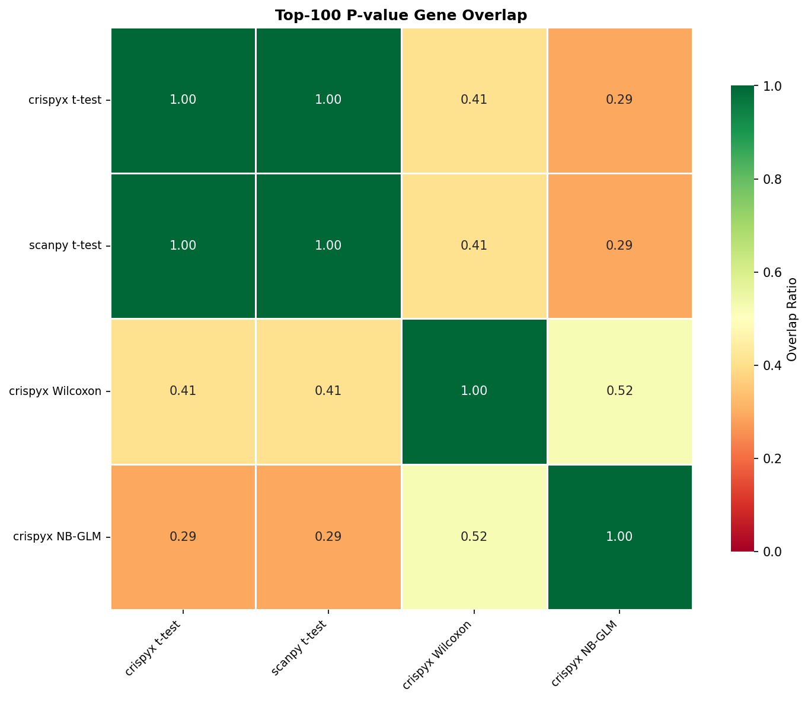

# Benchmark Results

## 1. Performance

### Preprocessing / QC

| Package | Method | Status | Total (s) | Memory (MB) | Cells | Genes |
| --- | --- | --- | --- | --- | --- | --- |
| crispyx | QC filter | success | 29.06 | 25133.25 | 244412.0 | 8749.0 |
| scanpy | QC filter | success | 51.79 | 33284.42 | 244412.0 | 8749.0 |
| crispyx | pseudobulk (avg log) | success | 33.33 | 1527.25 |  |  |
| crispyx | pseudobulk | success | 25.5 | 1383.47 |  |  |

### DE: t-test

| Package | Method | Status | Total (s) | Memory (MB) | Groups |
| --- | --- | --- | --- | --- | --- |
| scanpy | t-test | success | 183.95 | 11730.88 | 2393 |
| crispyx | t-test | success | 77.04 | 1874.09 | 2393 |

### DE: Wilcoxon

| Package | Method | Status | Total (s) | Memory (MB) | Groups |
| --- | --- | --- | --- | --- | --- |
| crispyx | Wilcoxon | success | 738.46 | 13829.73 | 2393.0 |
| scanpy | Wilcoxon | timeout | 21605.1 |  |  |

### DE: NB GLM

| Package | Method | Status | Total (s) | Memory (MB) | Groups |
| --- | --- | --- | --- | --- | --- |
| crispyx | NB-GLM | success | 12599.41 | 6521.04 | 2393.0 |
| edgeR | NB-GLM | timeout | 21605.04 |  |  |
| pertpy | NB-GLM | error | 17931.28 | 31149.64 |  |

## 2. Performance Comparison

### crispyx vs Reference Tools

_crispyx as baseline. Negative values = crispyx is faster/uses less memory._

#### Preprocessing / QC

| crispyx method | compared to | Time Δ | Time % |  | Mem Δ | Mem % |   |
| --- | --- | --- | --- | --- | --- | --- | --- |
| QC filter | scanpy QC filter | -22.7s | 56.1% | ✅ | -8151.2 MB | 75.5% | ✅ |

#### DE: t-test

| crispyx method | compared to | Time Δ | Time % |  | Mem Δ | Mem % |   |
| --- | --- | --- | --- | --- | --- | --- | --- |
| t-test | scanpy t-test | -106.9s | 41.9% | ✅ | -9856.8 MB | 16.0% | ✅ |

## 3. Accuracy

_Correlation metrics between crispyx and reference methods. ✅ >0.95, ⚠️ 0.8-0.95, ❌ <0.8_

### Preprocessing / QC

| crispyx method | compared to | Cells Δ |  | Genes Δ |   |
| --- | --- | --- | --- | --- | --- |
| QC filter | scanpy QC filter | +0 | ✅ | +0 | ✅ |

### DE: t-test

| crispyx method | compared to | Eff ρ |  | Eff ρₛ |   | Stat ρ |    | Stat ρₛ |     | log-Pval ρ |      | log-Pval ρₛ |       |
| --- | --- | --- | --- | --- | --- | --- | --- | --- | --- | --- | --- | --- | --- |
| t-test | scanpy t-test | 1.000 <small>±0.000</small> | ✅ | 1.000 <small>±0.000</small> | ✅ | 1.000 <small>±0.000</small> | ✅ | 1.000 <small>±0.000</small> | ✅ | 1.000 <small>±0.000</small> | ✅ | 1.000 <small>±0.000</small> | ✅ |

## 4. Gene Set Overlap

_Overlap ratio of top-k DE genes between methods. ✅ >0.7, ⚠️ 0.5-0.7, ❌ <0.5_

### Effect Size Overlap

| crispyx method | compared to | Top-50 |  | Top-100 |   | Top-500 |    |
| --- | --- | --- | --- | --- | --- | --- | --- |
| t-test | scanpy t-test | 1.000 | ✅ | 1.000 | ✅ | 1.000 | ✅ |

### P-value Overlap

| crispyx method | compared to | Top-50 |  | Top-100 |   | Top-500 |    |
| --- | --- | --- | --- | --- | --- | --- | --- |
| t-test | scanpy t-test | 1.000 | ✅ | 1.000 | ✅ | 1.000 | ✅ |

_Note: Some methods are missing due to errors:_
- NB-GLM vs edgeR NB-GLM: _method error: edger_de_glm (timeout)_
- NB-GLM vs pertpy NB-GLM: _method error: pertpy_de_pydeseq2 (error)_
- Wilcoxon vs scanpy Wilcoxon: _method error: scanpy_de_wilcoxon (timeout)_

### Overlap Heatmaps (Top-100)

#### Effect Size

#### P-value

---

**Legend:**
- **Performance:** ✅ >10% better | ⚠️ within ±10% | ❌ >10% worse
- **Accuracy:** ✅ ρ≥0.95 | ⚠️ 0.8≤ρ<0.95 | ❌ ρ<0.8
- **Overlap:** ✅ ≥0.7 | ⚠️ 0.5-0.7 | ❌ <0.5
- **Shrinkage:** ✅ <1% inflated | ⚠️ 1-10% inflated | ❌ >10% inflated

**Abbreviations:**
- ρ = Pearson correlation, ρₛ = Spearman correlation
- log-Pval = correlations on -log₁₀(p) transformed values
- sf=per = per-comparison size factor estimation (matches PyDESeq2)

**Notes:**
- Correlation and overlap values shown as mean±std across perturbations
- crispyx lfcShrink uses `method='stats'` (Gaussian approximation) which is numerically stable and ~35× faster than `method='full'`.
- P-value overlap excludes lfcShrink methods since shrinkage only affects effect sizes, not p-values.
- **Warning:** PyDESeq2 may produce aberrant shrinkage when dispersion trend fitting fails. crispyx shrinkage is more robust.
