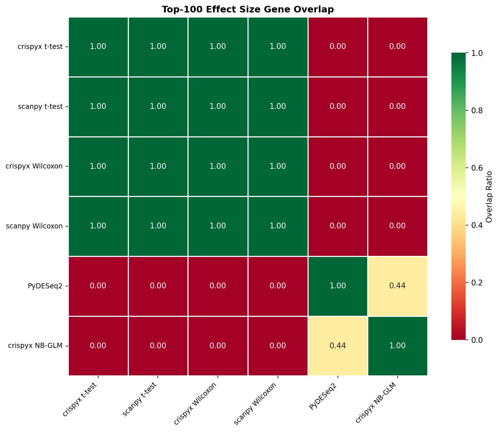
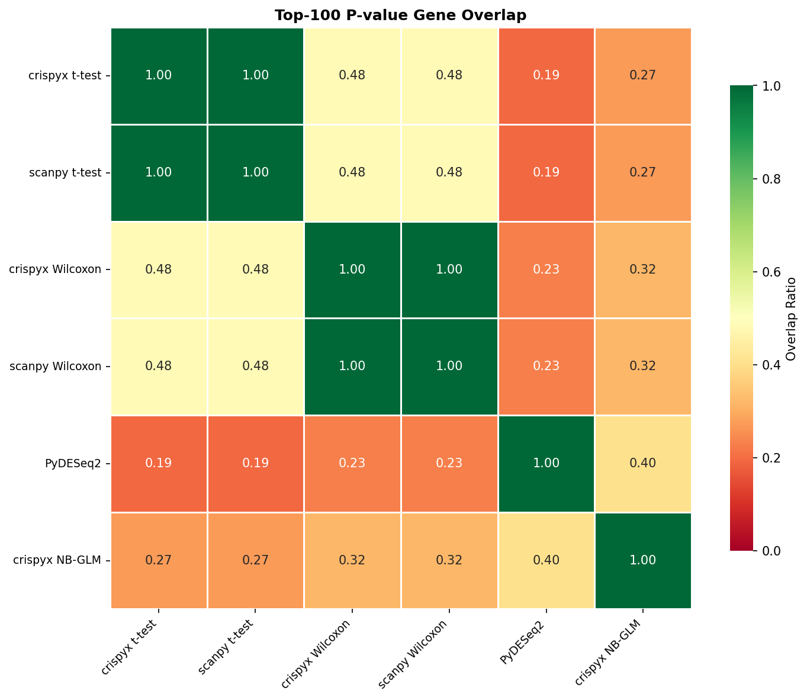

# Benchmark Results

## 1. Performance

### Preprocessing / QC

| Package | Method | Status | Total (s) | Memory (MB) | Cells | Genes |
| --- | --- | --- | --- | --- | --- | --- |
| crispyx | QC filter | success | 21.46 | 8143.57 | 21071.0 | 22040.0 |
| scanpy | QC filter | success | 7.63 | 2434.05 | 21071.0 | 22040.0 |
| crispyx | pseudobulk (avg log) | success | 17.53 | 3793.98 |  |  |
| crispyx | pseudobulk | success | 15.02 | 2745.71 |  |  |

### DE: t-test

| Package | Method | Status | Total (s) | Memory (MB) | Groups |
| --- | --- | --- | --- | --- | --- |
| scanpy | t-test | success | 20.26 | 1595.48 | 100 |
| crispyx | t-test | success | 5.48 | 647.71 | 100 |

### DE: Wilcoxon

| Package | Method | Status | Total (s) | Memory (MB) | Groups |
| --- | --- | --- | --- | --- | --- |
| crispyx | Wilcoxon | success | 24.48 | 1388.46 | 100 |
| scanpy | Wilcoxon | success | 135.48 | 2019.65 | 100 |

### DE: NB GLM

| Package | Method | Status | Total (s) | Memory (MB) | Groups |
| --- | --- | --- | --- | --- | --- |
| crispyx | NB-GLM | success | 220.45 | 1591.27 | 100.0 |
| edgeR | NB-GLM | timeout | 3605.06 |  |  |
| pertpy | NB-GLM | success | 1100.9 | 5427.6 | 100.0 |

## 2. Performance Comparison

### crispyx vs Reference Tools

_crispyx as baseline. Negative values = crispyx is faster/uses less memory._

#### Preprocessing / QC

| crispyx method | compared to | Time Δ | Time % |  | Mem Δ | Mem % |   |
| --- | --- | --- | --- | --- | --- | --- | --- |
| QC filter | scanpy QC filter | +13.8s | 281.1% | ❌ | +5709.5 MB | 334.6% | ❌ |

#### DE: t-test

| crispyx method | compared to | Time Δ | Time % |  | Mem Δ | Mem % |   |
| --- | --- | --- | --- | --- | --- | --- | --- |
| t-test | scanpy t-test | -14.8s | 27.0% | ✅ | -947.8 MB | 40.6% | ✅ |

#### DE: Wilcoxon

| crispyx method | compared to | Time Δ | Time % |  | Mem Δ | Mem % |   |
| --- | --- | --- | --- | --- | --- | --- | --- |
| Wilcoxon | scanpy Wilcoxon | -111.0s | 18.1% | ✅ | -631.2 MB | 68.7% | ✅ |

#### DE: NB GLM

| crispyx method | compared to | Time Δ | Time % |  | Mem Δ | Mem % |   |
| --- | --- | --- | --- | --- | --- | --- | --- |
| NB-GLM | pertpy NB-GLM | -880.5s | 20.0% | ✅ | -3836.3 MB | 29.3% | ✅ |

## 3. Accuracy

_Correlation metrics between crispyx and reference methods. ✅ >0.95, ⚠️ 0.8-0.95, ❌ <0.8_

### Preprocessing / QC

| crispyx method | compared to | Cells Δ |  | Genes Δ |   |
| --- | --- | --- | --- | --- | --- |
| QC filter | scanpy QC filter | +0 | ✅ | +0 | ✅ |

### DE: t-test

| crispyx method | compared to | Eff ρ |  | Eff ρₛ |   | Stat ρ |    | Stat ρₛ |     | log-Pval ρ |      | log-Pval ρₛ |       |
| --- | --- | --- | --- | --- | --- | --- | --- | --- | --- | --- | --- | --- | --- |
| t-test | scanpy t-test | 1.000 <small>±0.000</small> | ✅ | 1.000 <small>±0.000</small> | ✅ | 1.000 <small>±0.000</small> | ✅ | 1.000 <small>±0.000</small> | ✅ | 1.000 <small>±0.000</small> | ✅ | 1.000 <small>±0.000</small> | ✅ |

### DE: Wilcoxon

| crispyx method | compared to | Eff ρ |  | Eff ρₛ |   | Stat ρ |    | Stat ρₛ |     | log-Pval ρ |      | log-Pval ρₛ |       |
| --- | --- | --- | --- | --- | --- | --- | --- | --- | --- | --- | --- | --- | --- |
| Wilcoxon | scanpy Wilcoxon | 1.000 <small>±0.000</small> | ✅ | 1.000 <small>±0.000</small> | ✅ | 1.000 <small>±0.000</small> | ✅ | 1.000 <small>±0.000</small> | ✅ | 1.000 <small>±0.000</small> | ✅ | 1.000 <small>±0.000</small> | ✅ |

### DE: NB GLM

| crispyx method | compared to | Eff ρ |  | Eff ρₛ |   | Stat ρ |    | Stat ρₛ |     | log-Pval ρ |      | log-Pval ρₛ |       |
| --- | --- | --- | --- | --- | --- | --- | --- | --- | --- | --- | --- | --- | --- |
| NB-GLM | pertpy NB-GLM | 0.972 <small>±0.018</small> | ✅ | 0.968 <small>±0.026</small> | ✅ | 0.789 <small>±0.167</small> | ❌ | 0.581 <small>±0.282</small> | ❌ | 0.661 <small>±0.206</small> | ❌ | 0.561 <small>±0.220</small> | ❌ |

## 4. Gene Set Overlap

_Overlap ratio of top-k DE genes between methods. ✅ >0.7, ⚠️ 0.5-0.7, ❌ <0.5_

### Effect Size Overlap

| crispyx method | compared to | Top-50 |  | Top-100 |   | Top-500 |    |
| --- | --- | --- | --- | --- | --- | --- | --- |
| t-test | scanpy t-test | 1.000 | ✅ | 1.000 | ✅ | 1.000 | ✅ |
| Wilcoxon | scanpy Wilcoxon | 1.000 | ✅ | 1.000 | ✅ | 1.000 | ✅ |
| NB-GLM | pertpy NB-GLM | 0.460 | ❌ | 0.440 | ❌ | 0.421 | ❌ |

### P-value Overlap

| crispyx method | compared to | Top-50 |  | Top-100 |   | Top-500 |    |
| --- | --- | --- | --- | --- | --- | --- | --- |
| t-test | scanpy t-test | 1.000 | ✅ | 1.000 | ✅ | 1.000 | ✅ |
| Wilcoxon | scanpy Wilcoxon | 1.000 | ✅ | 1.000 | ✅ | 1.000 | ✅ |
| NB-GLM | pertpy NB-GLM | 0.373 | ❌ | 0.404 | ❌ | 0.474 | ❌ |

_Note: Some methods are missing due to errors:_
- NB-GLM vs edgeR NB-GLM: _method error: edger_de_glm (timeout)_

### Overlap Heatmaps (Top-100)

#### Effect Size

#### P-value

---

**Legend:**
- **Performance:** ✅ >10% better | ⚠️ within ±10% | ❌ >10% worse
- **Accuracy:** ✅ ρ≥0.95 | ⚠️ 0.8≤ρ<0.95 | ❌ ρ<0.8
- **Overlap:** ✅ ≥0.7 | ⚠️ 0.5-0.7 | ❌ <0.5
- **Shrinkage:** ✅ <1% inflated | ⚠️ 1-10% inflated | ❌ >10% inflated

**Abbreviations:**
- ρ = Pearson correlation, ρₛ = Spearman correlation
- log-Pval = correlations on -log₁₀(p) transformed values
- sf=per = per-comparison size factor estimation (matches PyDESeq2)

**Notes:**
- Correlation and overlap values shown as mean±std across perturbations
- crispyx lfcShrink uses `method='stats'` (Gaussian approximation) which is numerically stable and ~35× faster than `method='full'`.
- P-value overlap excludes lfcShrink methods since shrinkage only affects effect sizes, not p-values.
- **Warning:** PyDESeq2 may produce aberrant shrinkage when dispersion trend fitting fails. crispyx shrinkage is more robust.
